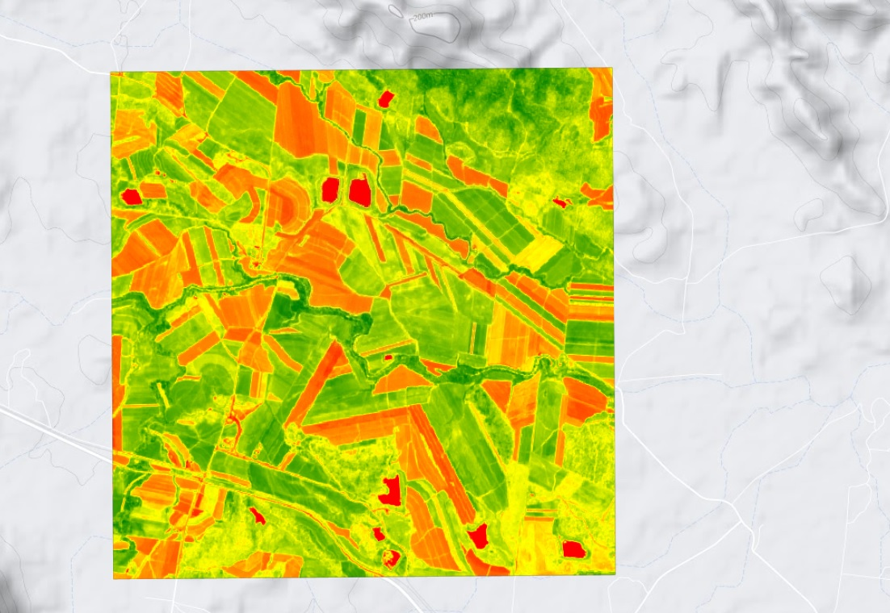

# NDVI-forcasting-LSTM

## What it does

This notebook looks at forecasting NDVI values obtained from satellite images of the sugarcane growing area of prosperine, Queensland Australia.
This was a challenge during the 2018 Melbourne Datathon.

## Models Used

This is work in progress and therefore more models and data sources will be added with time.
- [x] LSTM
- [ ] ARIMA